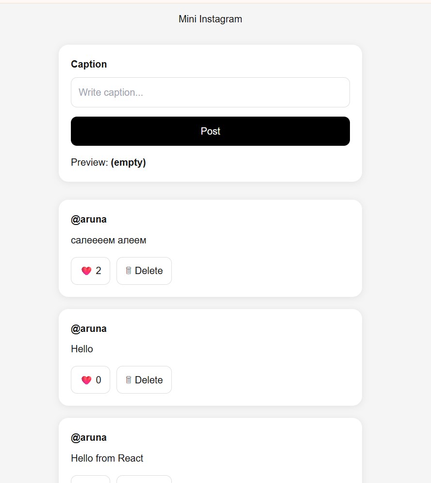

# 🚀 Mini Instagram

Mini Instagram is a full-stack social media application where users can create posts, like them, and delete them.

---

## 🌐 Live Demo

Frontend: https://mini-instagram-clean-new.vercel.app/
Backend:https://mini-instagram-clean-new.onrender.com

---

## 📸 Preview



---

## ⚙️ Tech Stack

### Frontend
- Next.js
- React
- TypeScript

### Backend
- FastAPI
- Python

### Database
- SQLite

### Deployment
- Vercel
- Render

---

## ✨ Features

- Create posts
- Like posts ❤️
- Delete posts 🗑
- Persistent storage (database)
- Full-stack API integration

---

## 🧠 Architecture

User → Frontend → Backend API → Database

---

## 🔗 API Endpoints

### GET /posts
Get all posts

### POST /posts
Create post

```json
{
  "caption": "Hello world"
}
